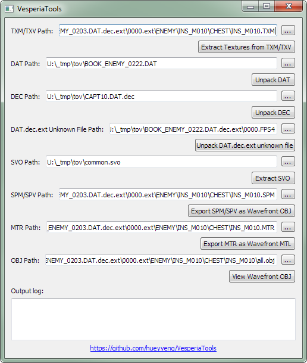

# VesperiaTools

Collection of scripts and tools to extract data from Tales of Vesperia Definitive Edition.

## Features

1. Extract meshes (with some issues).
2. Extract textures.
3. Parse SVO, DAT and FPS4 packages.
4. Export meshes as Wavefront OBJ.**

Take note that VesperiaTools will dump the parsed files within the same directory as the input file. Make sure to have
enough free disk space.

_**Refer to Known Issues_

## Requirements

> Bumping the minimum Python version to 3.10 to make use of newer Python features and syntax. Last tested with
> Python 3.10.11 and Windows 11.

- Python 3.10+
- Windows 10 or newer, Linux or macOS

## Running VesperiaTools



The use of virtual environment are highly recommended in isolating existing Python environment. Please refer to the
steps below:

```bash
python -m venv env
source env/Scripts/activate
pip install -r requirements/base.txt
python main.py
```

Refer to [https://realpython.com/python-virtual-environments-a-primer/](https://realpython.com/python-virtual-environments-a-primer/)
for more details on setting up a virtual environment.

Take note that I prefer `env` folder name for virtual environment. Other authors/projects uses `venv`
which is valid too. Do not get confuse with Python built-in `venv` module which is used to generate the
virtual environment.

## Known Issues

1. The exported Wavefront OBJ works in 3ds Max 2015 and Houdini 16.5. Maya 2014 can't import the exported Wavefront OBJ
   due to overlapping face indices value (it is a known quirk for Maya OBJ plugin)
2. The UVs for non-character meshes are wonky (read: unusable).
3. There is no material support yet for this release.

## TODO

- Text extraction and fix typo issues (e.g. missing whitespace, linebreak, etc)
- Creating a patcher to assists patching of data.
- Type annotate functions

## Credits

- __[Admiral Curtiss](https://github.com/AdmiralCurtiss)__
    - For creating HyoutaTools and figuring out the quirky unpacking method for PC Vesperia Definitive
      Edition [Link To Raised Issue](https://github.com/AdmiralCurtiss/HyoutaTools/issues/7).
    - GitHub repo: [HyoutaTools](https://github.com/AdmiralCurtiss/HyoutaTools)
- __[delguoqing](https://github.com/delguoqing)__
    - For sharing the Python 2 script that he wrote for extracting character meshes and textures for Xbox 360 Vesperia
      version.
    - GitHub repo: [tov_tools](https://github.com/delguoqing/various/tree/master/tov_tools)
- __Szkaradek123__ from Xentax forum
    - For sharing the Python 2 script for Blender 2.49 for extracting character meshes, skin weights, joints and
      textures for PC Vesperia Definitive Edition.

## Disclaimer

All Tales of Vesperia game content © 2008-2019 Bandai Namco Games Inc.
